# Class 5: Data Viz with ggplot
Mariam Benny (PID: 17103451)

Questions:

> Q1. For which phases is data visualization important in our scientific
> workflows?

All of the above

> Q2. True or False? The ggplot2 package comes already installed with R?

False

> Q3. Which plot types are typically NOT used to compare distributions
> of numeric variables?

Network graphs

> Q4. Which statement about data visualization with ggplot2 is
> incorrect?

ggplot is the only way to create plots in R

> Q5. Which geometric layer should be used to create scatter plots in
> ggplot2?

geom_point()

> Q6. In your own RStudio can you add a trend line layer to help show
> the relationship between the plot variables with the geom_smooth()
> function?

Yes I can, geom_smooth(method=“lm”) creates a trend line

> Q7. Argue with geom_smooth() to add a straight line from a linear
> model without the shaded standard error region?

Yes you can, you write geom_smooth(method=“lm”, se = FALSE) to remove
the shaded area.

> Q8. Use the nrow() function to find out how many genes are in this
> dataset. What is your answer?

5196 genes are in the data. I used nrow(genes).

> Q9. Use the colnames() function and the ncol() function on the genes
> data frame to find out what the column names are (we will need these
> later) and how many columns there are. How many columns did you find?

I found 4 columns using ncol(genes).

> Q10. Use the table() function on the State column of this data.frame
> to find out how many ‘up’ regulated genes there are. What is your
> answer?

There are 127 ‘up’ regulated genes. I used table(genes\$State).

> Q11. Using your values above and 2 significant figures. What fraction
> of total genes is up-regulated in this dataset?

I got 2.44% or 2.4% rounded to two sig figs as the fraction of genes in
the dataset that is up-regulated. I used the code
round(table(genes\$State)/nrow(genes) \* 100, 2).

> Q12. Complete the code below to produce a first basic scater plot of
> this gapminder_2007 dataset:

ggplot(gapminder_2007) + aes(x=gdpPercap, y=lifeExp) + geom_point()

> Q13. Can you adapt the code you have learned thus far to reproduce our
> gapminder scatter plot for the year 1957? What do you notice about
> this plot is it easy to compare with the one for 2007?

Yes I was able to adapt the code.There are continents on the plot for
1957, and I think it is a little hard to compare it with the one for
2007.

## Quarto

Quarto enables you to weave together content and executable code into a
finished document. To learn more about Quarto see <https://quarto.org>.

## Running Code

When you click the **Render** button a document will be generated that
includes both content and the output of embedded code. You can embed
code like this:

``` r
1 + 1
```

    [1] 2

You can add options to executable code like this

    [1] 4

The `echo: false` option disables the printing of code (only output is
displayed).

Key-point: for simple plots, ggplot is more verbose but as plots get
more complicated ggplot starts to be more clear and simple than base R
plot()

Once a package is installed I can load it up with the ‘library()’
function.

``` r
plot(cars)
```


``` r
head(cars)
```

      speed dist
    1     4    2
    2     4   10
    3     7    4
    4     7   22
    5     8   16
    6     9   10

``` r
#install.packages("ggplot2")
library(ggplot2)
ggplot(cars) +
  aes(speed, dist) +
  geom_point() +
  geom_smooth(method ="lm", se = FALSE) +
  labs(title="Stopping distance of old cars", subtitle="From the in-built cars dataset")
```

    `geom_smooth()` using formula = 'y ~ x'

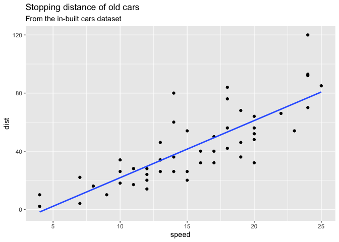

``` r
theme_bw()
```

    List of 136
     $ line                            :List of 6
      ..$ colour       : chr "black"
      ..$ linewidth    : num 0.5
      ..$ linetype     : num 1
      ..$ lineend      : chr "butt"
      ..$ arrow        : logi FALSE
      ..$ inherit.blank: logi TRUE
      ..- attr(*, "class")= chr [1:2] "element_line" "element"
     $ rect                            :List of 5
      ..$ fill         : chr "white"
      ..$ colour       : chr "black"
      ..$ linewidth    : num 0.5
      ..$ linetype     : num 1
      ..$ inherit.blank: logi TRUE
      ..- attr(*, "class")= chr [1:2] "element_rect" "element"
     $ text                            :List of 11
      ..$ family       : chr ""
      ..$ face         : chr "plain"
      ..$ colour       : chr "black"
      ..$ size         : num 11
      ..$ hjust        : num 0.5
      ..$ vjust        : num 0.5
      ..$ angle        : num 0
      ..$ lineheight   : num 0.9
      ..$ margin       : 'margin' num [1:4] 0points 0points 0points 0points
      .. ..- attr(*, "unit")= int 8
      ..$ debug        : logi FALSE
      ..$ inherit.blank: logi TRUE
      ..- attr(*, "class")= chr [1:2] "element_text" "element"
     $ title                           : NULL
     $ aspect.ratio                    : NULL
     $ axis.title                      : NULL
     $ axis.title.x                    :List of 11
      ..$ family       : NULL
      ..$ face         : NULL
      ..$ colour       : NULL
      ..$ size         : NULL
      ..$ hjust        : NULL
      ..$ vjust        : num 1
      ..$ angle        : NULL
      ..$ lineheight   : NULL
      ..$ margin       : 'margin' num [1:4] 2.75points 0points 0points 0points
      .. ..- attr(*, "unit")= int 8
      ..$ debug        : NULL
      ..$ inherit.blank: logi TRUE
      ..- attr(*, "class")= chr [1:2] "element_text" "element"
     $ axis.title.x.top                :List of 11
      ..$ family       : NULL
      ..$ face         : NULL
      ..$ colour       : NULL
      ..$ size         : NULL
      ..$ hjust        : NULL
      ..$ vjust        : num 0
      ..$ angle        : NULL
      ..$ lineheight   : NULL
      ..$ margin       : 'margin' num [1:4] 0points 0points 2.75points 0points
      .. ..- attr(*, "unit")= int 8
      ..$ debug        : NULL
      ..$ inherit.blank: logi TRUE
      ..- attr(*, "class")= chr [1:2] "element_text" "element"
     $ axis.title.x.bottom             : NULL
     $ axis.title.y                    :List of 11
      ..$ family       : NULL
      ..$ face         : NULL
      ..$ colour       : NULL
      ..$ size         : NULL
      ..$ hjust        : NULL
      ..$ vjust        : num 1
      ..$ angle        : num 90
      ..$ lineheight   : NULL
      ..$ margin       : 'margin' num [1:4] 0points 2.75points 0points 0points
      .. ..- attr(*, "unit")= int 8
      ..$ debug        : NULL
      ..$ inherit.blank: logi TRUE
      ..- attr(*, "class")= chr [1:2] "element_text" "element"
     $ axis.title.y.left               : NULL
     $ axis.title.y.right              :List of 11
      ..$ family       : NULL
      ..$ face         : NULL
      ..$ colour       : NULL
      ..$ size         : NULL
      ..$ hjust        : NULL
      ..$ vjust        : num 1
      ..$ angle        : num -90
      ..$ lineheight   : NULL
      ..$ margin       : 'margin' num [1:4] 0points 0points 0points 2.75points
      .. ..- attr(*, "unit")= int 8
      ..$ debug        : NULL
      ..$ inherit.blank: logi TRUE
      ..- attr(*, "class")= chr [1:2] "element_text" "element"
     $ axis.text                       :List of 11
      ..$ family       : NULL
      ..$ face         : NULL
      ..$ colour       : chr "grey30"
      ..$ size         : 'rel' num 0.8
      ..$ hjust        : NULL
      ..$ vjust        : NULL
      ..$ angle        : NULL
      ..$ lineheight   : NULL
      ..$ margin       : NULL
      ..$ debug        : NULL
      ..$ inherit.blank: logi TRUE
      ..- attr(*, "class")= chr [1:2] "element_text" "element"
     $ axis.text.x                     :List of 11
      ..$ family       : NULL
      ..$ face         : NULL
      ..$ colour       : NULL
      ..$ size         : NULL
      ..$ hjust        : NULL
      ..$ vjust        : num 1
      ..$ angle        : NULL
      ..$ lineheight   : NULL
      ..$ margin       : 'margin' num [1:4] 2.2points 0points 0points 0points
      .. ..- attr(*, "unit")= int 8
      ..$ debug        : NULL
      ..$ inherit.blank: logi TRUE
      ..- attr(*, "class")= chr [1:2] "element_text" "element"
     $ axis.text.x.top                 :List of 11
      ..$ family       : NULL
      ..$ face         : NULL
      ..$ colour       : NULL
      ..$ size         : NULL
      ..$ hjust        : NULL
      ..$ vjust        : num 0
      ..$ angle        : NULL
      ..$ lineheight   : NULL
      ..$ margin       : 'margin' num [1:4] 0points 0points 2.2points 0points
      .. ..- attr(*, "unit")= int 8
      ..$ debug        : NULL
      ..$ inherit.blank: logi TRUE
      ..- attr(*, "class")= chr [1:2] "element_text" "element"
     $ axis.text.x.bottom              : NULL
     $ axis.text.y                     :List of 11
      ..$ family       : NULL
      ..$ face         : NULL
      ..$ colour       : NULL
      ..$ size         : NULL
      ..$ hjust        : num 1
      ..$ vjust        : NULL
      ..$ angle        : NULL
      ..$ lineheight   : NULL
      ..$ margin       : 'margin' num [1:4] 0points 2.2points 0points 0points
      .. ..- attr(*, "unit")= int 8
      ..$ debug        : NULL
      ..$ inherit.blank: logi TRUE
      ..- attr(*, "class")= chr [1:2] "element_text" "element"
     $ axis.text.y.left                : NULL
     $ axis.text.y.right               :List of 11
      ..$ family       : NULL
      ..$ face         : NULL
      ..$ colour       : NULL
      ..$ size         : NULL
      ..$ hjust        : num 0
      ..$ vjust        : NULL
      ..$ angle        : NULL
      ..$ lineheight   : NULL
      ..$ margin       : 'margin' num [1:4] 0points 0points 0points 2.2points
      .. ..- attr(*, "unit")= int 8
      ..$ debug        : NULL
      ..$ inherit.blank: logi TRUE
      ..- attr(*, "class")= chr [1:2] "element_text" "element"
     $ axis.text.theta                 : NULL
     $ axis.text.r                     :List of 11
      ..$ family       : NULL
      ..$ face         : NULL
      ..$ colour       : NULL
      ..$ size         : NULL
      ..$ hjust        : num 0.5
      ..$ vjust        : NULL
      ..$ angle        : NULL
      ..$ lineheight   : NULL
      ..$ margin       : 'margin' num [1:4] 0points 2.2points 0points 2.2points
      .. ..- attr(*, "unit")= int 8
      ..$ debug        : NULL
      ..$ inherit.blank: logi TRUE
      ..- attr(*, "class")= chr [1:2] "element_text" "element"
     $ axis.ticks                      :List of 6
      ..$ colour       : chr "grey20"
      ..$ linewidth    : NULL
      ..$ linetype     : NULL
      ..$ lineend      : NULL
      ..$ arrow        : logi FALSE
      ..$ inherit.blank: logi TRUE
      ..- attr(*, "class")= chr [1:2] "element_line" "element"
     $ axis.ticks.x                    : NULL
     $ axis.ticks.x.top                : NULL
     $ axis.ticks.x.bottom             : NULL
     $ axis.ticks.y                    : NULL
     $ axis.ticks.y.left               : NULL
     $ axis.ticks.y.right              : NULL
     $ axis.ticks.theta                : NULL
     $ axis.ticks.r                    : NULL
     $ axis.minor.ticks.x.top          : NULL
     $ axis.minor.ticks.x.bottom       : NULL
     $ axis.minor.ticks.y.left         : NULL
     $ axis.minor.ticks.y.right        : NULL
     $ axis.minor.ticks.theta          : NULL
     $ axis.minor.ticks.r              : NULL
     $ axis.ticks.length               : 'simpleUnit' num 2.75points
      ..- attr(*, "unit")= int 8
     $ axis.ticks.length.x             : NULL
     $ axis.ticks.length.x.top         : NULL
     $ axis.ticks.length.x.bottom      : NULL
     $ axis.ticks.length.y             : NULL
     $ axis.ticks.length.y.left        : NULL
     $ axis.ticks.length.y.right       : NULL
     $ axis.ticks.length.theta         : NULL
     $ axis.ticks.length.r             : NULL
     $ axis.minor.ticks.length         : 'rel' num 0.75
     $ axis.minor.ticks.length.x       : NULL
     $ axis.minor.ticks.length.x.top   : NULL
     $ axis.minor.ticks.length.x.bottom: NULL
     $ axis.minor.ticks.length.y       : NULL
     $ axis.minor.ticks.length.y.left  : NULL
     $ axis.minor.ticks.length.y.right : NULL
     $ axis.minor.ticks.length.theta   : NULL
     $ axis.minor.ticks.length.r       : NULL
     $ axis.line                       : list()
      ..- attr(*, "class")= chr [1:2] "element_blank" "element"
     $ axis.line.x                     : NULL
     $ axis.line.x.top                 : NULL
     $ axis.line.x.bottom              : NULL
     $ axis.line.y                     : NULL
     $ axis.line.y.left                : NULL
     $ axis.line.y.right               : NULL
     $ axis.line.theta                 : NULL
     $ axis.line.r                     : NULL
     $ legend.background               :List of 5
      ..$ fill         : NULL
      ..$ colour       : logi NA
      ..$ linewidth    : NULL
      ..$ linetype     : NULL
      ..$ inherit.blank: logi TRUE
      ..- attr(*, "class")= chr [1:2] "element_rect" "element"
     $ legend.margin                   : 'margin' num [1:4] 5.5points 5.5points 5.5points 5.5points
      ..- attr(*, "unit")= int 8
     $ legend.spacing                  : 'simpleUnit' num 11points
      ..- attr(*, "unit")= int 8
     $ legend.spacing.x                : NULL
     $ legend.spacing.y                : NULL
     $ legend.key                      : NULL
     $ legend.key.size                 : 'simpleUnit' num 1.2lines
      ..- attr(*, "unit")= int 3
     $ legend.key.height               : NULL
     $ legend.key.width                : NULL
     $ legend.key.spacing              : 'simpleUnit' num 5.5points
      ..- attr(*, "unit")= int 8
     $ legend.key.spacing.x            : NULL
     $ legend.key.spacing.y            : NULL
     $ legend.frame                    : NULL
     $ legend.ticks                    : NULL
     $ legend.ticks.length             : 'rel' num 0.2
     $ legend.axis.line                : NULL
     $ legend.text                     :List of 11
      ..$ family       : NULL
      ..$ face         : NULL
      ..$ colour       : NULL
      ..$ size         : 'rel' num 0.8
      ..$ hjust        : NULL
      ..$ vjust        : NULL
      ..$ angle        : NULL
      ..$ lineheight   : NULL
      ..$ margin       : NULL
      ..$ debug        : NULL
      ..$ inherit.blank: logi TRUE
      ..- attr(*, "class")= chr [1:2] "element_text" "element"
     $ legend.text.position            : NULL
     $ legend.title                    :List of 11
      ..$ family       : NULL
      ..$ face         : NULL
      ..$ colour       : NULL
      ..$ size         : NULL
      ..$ hjust        : num 0
      ..$ vjust        : NULL
      ..$ angle        : NULL
      ..$ lineheight   : NULL
      ..$ margin       : NULL
      ..$ debug        : NULL
      ..$ inherit.blank: logi TRUE
      ..- attr(*, "class")= chr [1:2] "element_text" "element"
     $ legend.title.position           : NULL
     $ legend.position                 : chr "right"
     $ legend.position.inside          : NULL
     $ legend.direction                : NULL
     $ legend.byrow                    : NULL
     $ legend.justification            : chr "center"
     $ legend.justification.top        : NULL
     $ legend.justification.bottom     : NULL
     $ legend.justification.left       : NULL
     $ legend.justification.right      : NULL
     $ legend.justification.inside     : NULL
     $ legend.location                 : NULL
     $ legend.box                      : NULL
     $ legend.box.just                 : NULL
     $ legend.box.margin               : 'margin' num [1:4] 0cm 0cm 0cm 0cm
      ..- attr(*, "unit")= int 1
     $ legend.box.background           : list()
      ..- attr(*, "class")= chr [1:2] "element_blank" "element"
     $ legend.box.spacing              : 'simpleUnit' num 11points
      ..- attr(*, "unit")= int 8
      [list output truncated]
     - attr(*, "class")= chr [1:2] "theme" "gg"
     - attr(*, "complete")= logi TRUE
     - attr(*, "validate")= logi TRUE

``` r
url <- "https://bioboot.github.io/bimm143_S20/class-material/up_down_expression.txt"
genes <- read.delim(url)
```

``` r
nrow(genes)
```

    [1] 5196

``` r
colnames(genes)
```

    [1] "Gene"       "Condition1" "Condition2" "State"     

``` r
ncol(genes)
```

    [1] 4

``` r
table(genes$State)
```


          down unchanging         up 
            72       4997        127 

``` r
round( table(genes$State)/nrow(genes) * 100, 2 )
```


          down unchanging         up 
          1.39      96.17       2.44 

A first plot:

``` r
ggplot(genes) +
  aes(Condition1, Condition2) +
  geom_point(col="blue")
```

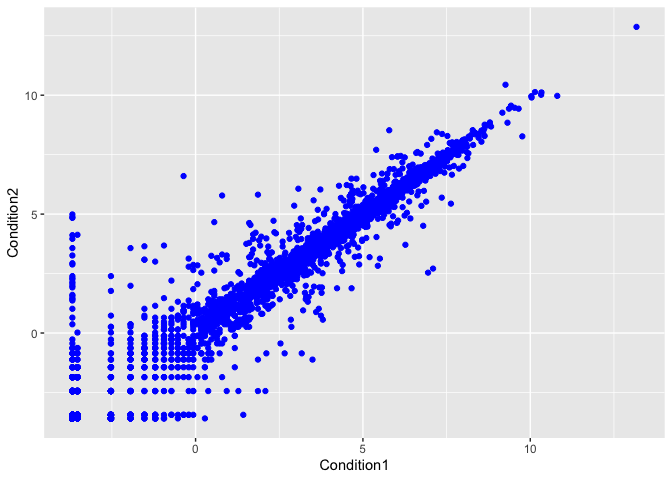

``` r
p <- ggplot(genes) + 
    aes(x=Condition1, y=Condition2, col=State) +
    geom_point()
p
```

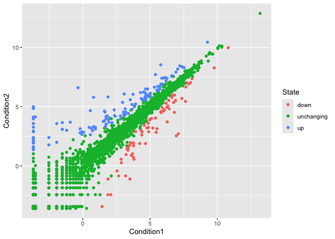

``` r
p + scale_colour_manual( values=c("blue","gray","red") ) +
labs(title="Gene Expresion Changes Upon Drug Treatment",
         x="Control (no drug) ",
         y="Drug Treatment")
```

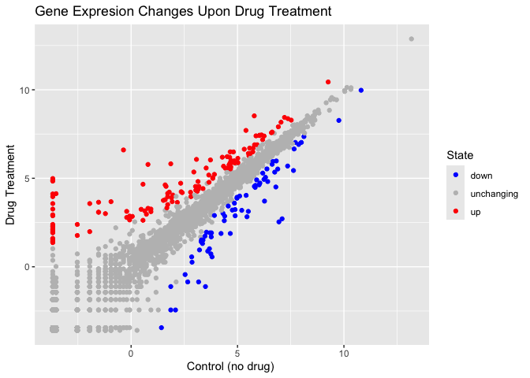

``` r
library(gapminder)
```

``` r
length(gapminder$year)
```

    [1] 1704

``` r
gapminder$year
```

       [1] 1952 1957 1962 1967 1972 1977 1982 1987 1992 1997 2002 2007 1952 1957
      [15] 1962 1967 1972 1977 1982 1987 1992 1997 2002 2007 1952 1957 1962 1967
      [29] 1972 1977 1982 1987 1992 1997 2002 2007 1952 1957 1962 1967 1972 1977
      [43] 1982 1987 1992 1997 2002 2007 1952 1957 1962 1967 1972 1977 1982 1987
      [57] 1992 1997 2002 2007 1952 1957 1962 1967 1972 1977 1982 1987 1992 1997
      [71] 2002 2007 1952 1957 1962 1967 1972 1977 1982 1987 1992 1997 2002 2007
      [85] 1952 1957 1962 1967 1972 1977 1982 1987 1992 1997 2002 2007 1952 1957
      [99] 1962 1967 1972 1977 1982 1987 1992 1997 2002 2007 1952 1957 1962 1967
     [113] 1972 1977 1982 1987 1992 1997 2002 2007 1952 1957 1962 1967 1972 1977
     [127] 1982 1987 1992 1997 2002 2007 1952 1957 1962 1967 1972 1977 1982 1987
     [141] 1992 1997 2002 2007 1952 1957 1962 1967 1972 1977 1982 1987 1992 1997
     [155] 2002 2007 1952 1957 1962 1967 1972 1977 1982 1987 1992 1997 2002 2007
     [169] 1952 1957 1962 1967 1972 1977 1982 1987 1992 1997 2002 2007 1952 1957
     [183] 1962 1967 1972 1977 1982 1987 1992 1997 2002 2007 1952 1957 1962 1967
     [197] 1972 1977 1982 1987 1992 1997 2002 2007 1952 1957 1962 1967 1972 1977
     [211] 1982 1987 1992 1997 2002 2007 1952 1957 1962 1967 1972 1977 1982 1987
     [225] 1992 1997 2002 2007 1952 1957 1962 1967 1972 1977 1982 1987 1992 1997
     [239] 2002 2007 1952 1957 1962 1967 1972 1977 1982 1987 1992 1997 2002 2007
     [253] 1952 1957 1962 1967 1972 1977 1982 1987 1992 1997 2002 2007 1952 1957
     [267] 1962 1967 1972 1977 1982 1987 1992 1997 2002 2007 1952 1957 1962 1967
     [281] 1972 1977 1982 1987 1992 1997 2002 2007 1952 1957 1962 1967 1972 1977
     [295] 1982 1987 1992 1997 2002 2007 1952 1957 1962 1967 1972 1977 1982 1987
     [309] 1992 1997 2002 2007 1952 1957 1962 1967 1972 1977 1982 1987 1992 1997
     [323] 2002 2007 1952 1957 1962 1967 1972 1977 1982 1987 1992 1997 2002 2007
     [337] 1952 1957 1962 1967 1972 1977 1982 1987 1992 1997 2002 2007 1952 1957
     [351] 1962 1967 1972 1977 1982 1987 1992 1997 2002 2007 1952 1957 1962 1967
     [365] 1972 1977 1982 1987 1992 1997 2002 2007 1952 1957 1962 1967 1972 1977
     [379] 1982 1987 1992 1997 2002 2007 1952 1957 1962 1967 1972 1977 1982 1987
     [393] 1992 1997 2002 2007 1952 1957 1962 1967 1972 1977 1982 1987 1992 1997
     [407] 2002 2007 1952 1957 1962 1967 1972 1977 1982 1987 1992 1997 2002 2007
     [421] 1952 1957 1962 1967 1972 1977 1982 1987 1992 1997 2002 2007 1952 1957
     [435] 1962 1967 1972 1977 1982 1987 1992 1997 2002 2007 1952 1957 1962 1967
     [449] 1972 1977 1982 1987 1992 1997 2002 2007 1952 1957 1962 1967 1972 1977
     [463] 1982 1987 1992 1997 2002 2007 1952 1957 1962 1967 1972 1977 1982 1987
     [477] 1992 1997 2002 2007 1952 1957 1962 1967 1972 1977 1982 1987 1992 1997
     [491] 2002 2007 1952 1957 1962 1967 1972 1977 1982 1987 1992 1997 2002 2007
     [505] 1952 1957 1962 1967 1972 1977 1982 1987 1992 1997 2002 2007 1952 1957
     [519] 1962 1967 1972 1977 1982 1987 1992 1997 2002 2007 1952 1957 1962 1967
     [533] 1972 1977 1982 1987 1992 1997 2002 2007 1952 1957 1962 1967 1972 1977
     [547] 1982 1987 1992 1997 2002 2007 1952 1957 1962 1967 1972 1977 1982 1987
     [561] 1992 1997 2002 2007 1952 1957 1962 1967 1972 1977 1982 1987 1992 1997
     [575] 2002 2007 1952 1957 1962 1967 1972 1977 1982 1987 1992 1997 2002 2007
     [589] 1952 1957 1962 1967 1972 1977 1982 1987 1992 1997 2002 2007 1952 1957
     [603] 1962 1967 1972 1977 1982 1987 1992 1997 2002 2007 1952 1957 1962 1967
     [617] 1972 1977 1982 1987 1992 1997 2002 2007 1952 1957 1962 1967 1972 1977
     [631] 1982 1987 1992 1997 2002 2007 1952 1957 1962 1967 1972 1977 1982 1987
     [645] 1992 1997 2002 2007 1952 1957 1962 1967 1972 1977 1982 1987 1992 1997
     [659] 2002 2007 1952 1957 1962 1967 1972 1977 1982 1987 1992 1997 2002 2007
     [673] 1952 1957 1962 1967 1972 1977 1982 1987 1992 1997 2002 2007 1952 1957
     [687] 1962 1967 1972 1977 1982 1987 1992 1997 2002 2007 1952 1957 1962 1967
     [701] 1972 1977 1982 1987 1992 1997 2002 2007 1952 1957 1962 1967 1972 1977
     [715] 1982 1987 1992 1997 2002 2007 1952 1957 1962 1967 1972 1977 1982 1987
     [729] 1992 1997 2002 2007 1952 1957 1962 1967 1972 1977 1982 1987 1992 1997
     [743] 2002 2007 1952 1957 1962 1967 1972 1977 1982 1987 1992 1997 2002 2007
     [757] 1952 1957 1962 1967 1972 1977 1982 1987 1992 1997 2002 2007 1952 1957
     [771] 1962 1967 1972 1977 1982 1987 1992 1997 2002 2007 1952 1957 1962 1967
     [785] 1972 1977 1982 1987 1992 1997 2002 2007 1952 1957 1962 1967 1972 1977
     [799] 1982 1987 1992 1997 2002 2007 1952 1957 1962 1967 1972 1977 1982 1987
     [813] 1992 1997 2002 2007 1952 1957 1962 1967 1972 1977 1982 1987 1992 1997
     [827] 2002 2007 1952 1957 1962 1967 1972 1977 1982 1987 1992 1997 2002 2007
     [841] 1952 1957 1962 1967 1972 1977 1982 1987 1992 1997 2002 2007 1952 1957
     [855] 1962 1967 1972 1977 1982 1987 1992 1997 2002 2007 1952 1957 1962 1967
     [869] 1972 1977 1982 1987 1992 1997 2002 2007 1952 1957 1962 1967 1972 1977
     [883] 1982 1987 1992 1997 2002 2007 1952 1957 1962 1967 1972 1977 1982 1987
     [897] 1992 1997 2002 2007 1952 1957 1962 1967 1972 1977 1982 1987 1992 1997
     [911] 2002 2007 1952 1957 1962 1967 1972 1977 1982 1987 1992 1997 2002 2007
     [925] 1952 1957 1962 1967 1972 1977 1982 1987 1992 1997 2002 2007 1952 1957
     [939] 1962 1967 1972 1977 1982 1987 1992 1997 2002 2007 1952 1957 1962 1967
     [953] 1972 1977 1982 1987 1992 1997 2002 2007 1952 1957 1962 1967 1972 1977
     [967] 1982 1987 1992 1997 2002 2007 1952 1957 1962 1967 1972 1977 1982 1987
     [981] 1992 1997 2002 2007 1952 1957 1962 1967 1972 1977 1982 1987 1992 1997
     [995] 2002 2007 1952 1957 1962 1967 1972 1977 1982 1987 1992 1997 2002 2007
    [1009] 1952 1957 1962 1967 1972 1977 1982 1987 1992 1997 2002 2007 1952 1957
    [1023] 1962 1967 1972 1977 1982 1987 1992 1997 2002 2007 1952 1957 1962 1967
    [1037] 1972 1977 1982 1987 1992 1997 2002 2007 1952 1957 1962 1967 1972 1977
    [1051] 1982 1987 1992 1997 2002 2007 1952 1957 1962 1967 1972 1977 1982 1987
    [1065] 1992 1997 2002 2007 1952 1957 1962 1967 1972 1977 1982 1987 1992 1997
    [1079] 2002 2007 1952 1957 1962 1967 1972 1977 1982 1987 1992 1997 2002 2007
    [1093] 1952 1957 1962 1967 1972 1977 1982 1987 1992 1997 2002 2007 1952 1957
    [1107] 1962 1967 1972 1977 1982 1987 1992 1997 2002 2007 1952 1957 1962 1967
    [1121] 1972 1977 1982 1987 1992 1997 2002 2007 1952 1957 1962 1967 1972 1977
    [1135] 1982 1987 1992 1997 2002 2007 1952 1957 1962 1967 1972 1977 1982 1987
    [1149] 1992 1997 2002 2007 1952 1957 1962 1967 1972 1977 1982 1987 1992 1997
    [1163] 2002 2007 1952 1957 1962 1967 1972 1977 1982 1987 1992 1997 2002 2007
    [1177] 1952 1957 1962 1967 1972 1977 1982 1987 1992 1997 2002 2007 1952 1957
    [1191] 1962 1967 1972 1977 1982 1987 1992 1997 2002 2007 1952 1957 1962 1967
    [1205] 1972 1977 1982 1987 1992 1997 2002 2007 1952 1957 1962 1967 1972 1977
    [1219] 1982 1987 1992 1997 2002 2007 1952 1957 1962 1967 1972 1977 1982 1987
    [1233] 1992 1997 2002 2007 1952 1957 1962 1967 1972 1977 1982 1987 1992 1997
    [1247] 2002 2007 1952 1957 1962 1967 1972 1977 1982 1987 1992 1997 2002 2007
    [1261] 1952 1957 1962 1967 1972 1977 1982 1987 1992 1997 2002 2007 1952 1957
    [1275] 1962 1967 1972 1977 1982 1987 1992 1997 2002 2007 1952 1957 1962 1967
    [1289] 1972 1977 1982 1987 1992 1997 2002 2007 1952 1957 1962 1967 1972 1977
    [1303] 1982 1987 1992 1997 2002 2007 1952 1957 1962 1967 1972 1977 1982 1987
    [1317] 1992 1997 2002 2007 1952 1957 1962 1967 1972 1977 1982 1987 1992 1997
    [1331] 2002 2007 1952 1957 1962 1967 1972 1977 1982 1987 1992 1997 2002 2007
    [1345] 1952 1957 1962 1967 1972 1977 1982 1987 1992 1997 2002 2007 1952 1957
    [1359] 1962 1967 1972 1977 1982 1987 1992 1997 2002 2007 1952 1957 1962 1967
    [1373] 1972 1977 1982 1987 1992 1997 2002 2007 1952 1957 1962 1967 1972 1977
    [1387] 1982 1987 1992 1997 2002 2007 1952 1957 1962 1967 1972 1977 1982 1987
    [1401] 1992 1997 2002 2007 1952 1957 1962 1967 1972 1977 1982 1987 1992 1997
    [1415] 2002 2007 1952 1957 1962 1967 1972 1977 1982 1987 1992 1997 2002 2007
    [1429] 1952 1957 1962 1967 1972 1977 1982 1987 1992 1997 2002 2007 1952 1957
    [1443] 1962 1967 1972 1977 1982 1987 1992 1997 2002 2007 1952 1957 1962 1967
    [1457] 1972 1977 1982 1987 1992 1997 2002 2007 1952 1957 1962 1967 1972 1977
    [1471] 1982 1987 1992 1997 2002 2007 1952 1957 1962 1967 1972 1977 1982 1987
    [1485] 1992 1997 2002 2007 1952 1957 1962 1967 1972 1977 1982 1987 1992 1997
    [1499] 2002 2007 1952 1957 1962 1967 1972 1977 1982 1987 1992 1997 2002 2007
    [1513] 1952 1957 1962 1967 1972 1977 1982 1987 1992 1997 2002 2007 1952 1957
    [1527] 1962 1967 1972 1977 1982 1987 1992 1997 2002 2007 1952 1957 1962 1967
    [1541] 1972 1977 1982 1987 1992 1997 2002 2007 1952 1957 1962 1967 1972 1977
    [1555] 1982 1987 1992 1997 2002 2007 1952 1957 1962 1967 1972 1977 1982 1987
    [1569] 1992 1997 2002 2007 1952 1957 1962 1967 1972 1977 1982 1987 1992 1997
    [1583] 2002 2007 1952 1957 1962 1967 1972 1977 1982 1987 1992 1997 2002 2007
    [1597] 1952 1957 1962 1967 1972 1977 1982 1987 1992 1997 2002 2007 1952 1957
    [1611] 1962 1967 1972 1977 1982 1987 1992 1997 2002 2007 1952 1957 1962 1967
    [1625] 1972 1977 1982 1987 1992 1997 2002 2007 1952 1957 1962 1967 1972 1977
    [1639] 1982 1987 1992 1997 2002 2007 1952 1957 1962 1967 1972 1977 1982 1987
    [1653] 1992 1997 2002 2007 1952 1957 1962 1967 1972 1977 1982 1987 1992 1997
    [1667] 2002 2007 1952 1957 1962 1967 1972 1977 1982 1987 1992 1997 2002 2007
    [1681] 1952 1957 1962 1967 1972 1977 1982 1987 1992 1997 2002 2007 1952 1957
    [1695] 1962 1967 1972 1977 1982 1987 1992 1997 2002 2007

``` r
table(gapminder$year)
```


    1952 1957 1962 1967 1972 1977 1982 1987 1992 1997 2002 2007 
     142  142  142  142  142  142  142  142  142  142  142  142 

``` r
length(unique(gapminder$year))
```

    [1] 12

``` r
library(dplyr)
```


    Attaching package: 'dplyr'

    The following objects are masked from 'package:stats':

        filter, lag

    The following objects are masked from 'package:base':

        intersect, setdiff, setequal, union

``` r
gapminder_2007 <- gapminder %>% filter(year==2007)
# File location online
url <- "https://raw.githubusercontent.com/jennybc/gapminder/master/inst/extdata/gapminder.tsv"

gapminder <- read.delim(url)
```

``` r
filter(gapminder, country=="Unites States")
```

    [1] country   continent year      lifeExp   pop       gdpPercap
    <0 rows> (or 0-length row.names)

``` r
ggplot(gapminder_2007) +
  aes(x=gdpPercap, y=lifeExp) +
  geom_point(alpha=0.5)
```


``` r
ggplot(gapminder_2007) +
  aes(x=gdpPercap, y=lifeExp, color=continent, size=pop) +
  geom_point(alpha=0.5)
```

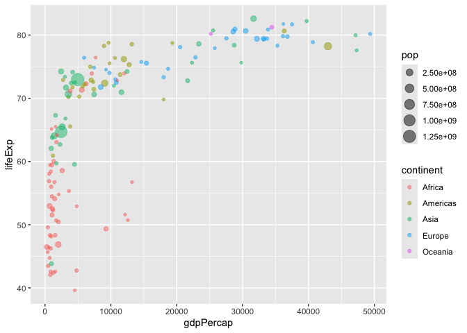

``` r
ggplot(gapminder_2007) + 
  aes(x = gdpPercap, y = lifeExp, color = pop) +
  geom_point(alpha=0.8)
```

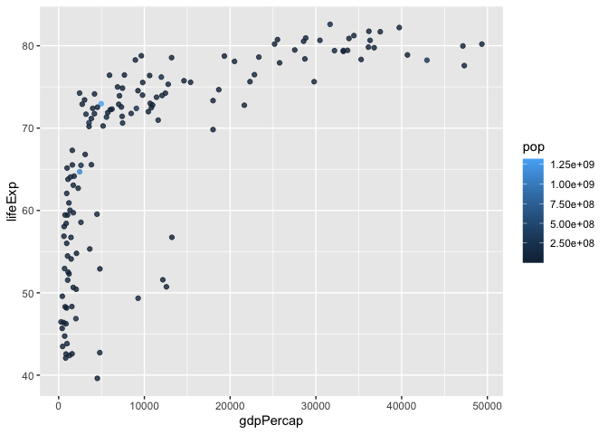

``` r
ggplot(gapminder_2007) + 
  aes(x = gdpPercap, y = lifeExp, size = pop) +
  geom_point(alpha=0.5)
```

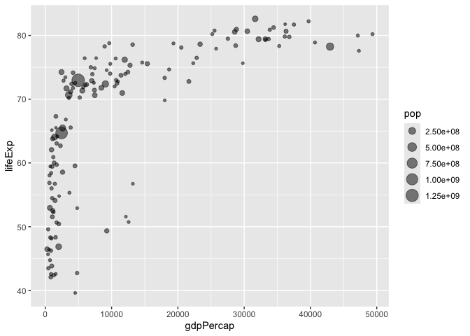

``` r
ggplot(gapminder_2007) + 
  geom_point(aes(x = gdpPercap, y = lifeExp,
                 size = pop), alpha=0.5) + 
  scale_size_area(max_size = 10)
```

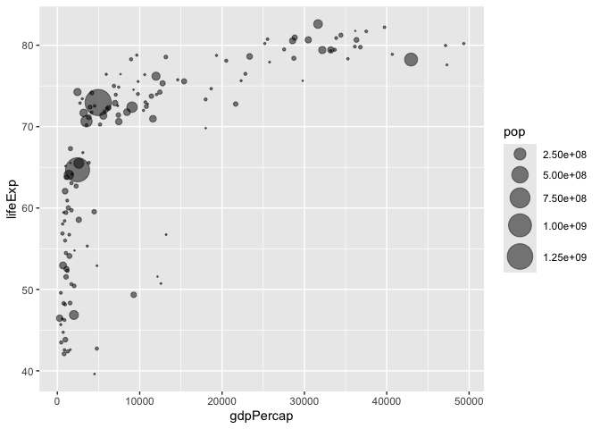

``` r
gapminder_1957 <- gapminder %>% filter(year==1957)

ggplot(gapminder_1957) + 
  aes(x = gdpPercap, y = lifeExp, color=continent,
                 size = pop) +
  geom_point(alpha=0.7) + 
  scale_size_area(max_size = 10) 
```

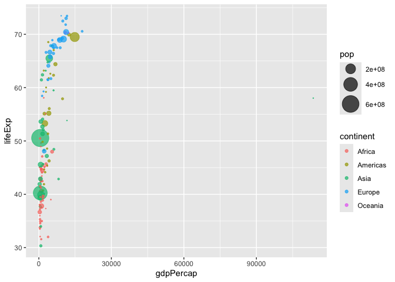

``` r
gapminder_1957 <- gapminder %>% filter(year==1957 | year==2007)

ggplot(gapminder_1957) + 
  geom_point(aes(x = gdpPercap, y = lifeExp, color=continent,
                 size = pop), alpha=0.7) + 
  scale_size_area(max_size = 10) +
  facet_wrap(~year)
```

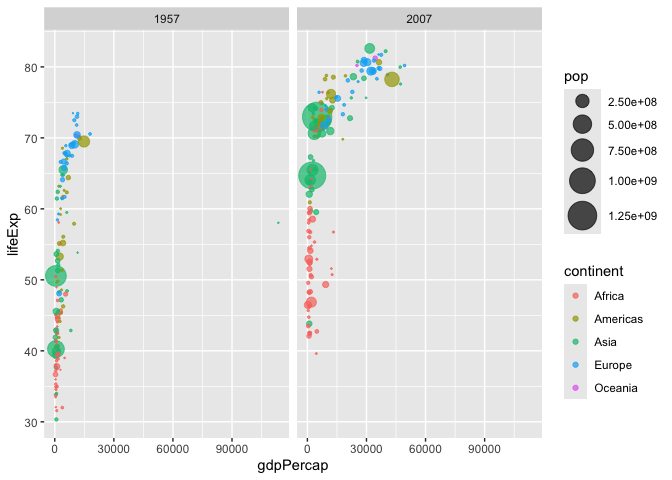

``` r
gapminder_top5 <- gapminder %>% 
  filter(year==2007) %>% 
  arrange(desc(pop)) %>% 
  top_n(5, pop)

gapminder_top5
```

            country continent year lifeExp        pop gdpPercap
    1         China      Asia 2007  72.961 1318683096  4959.115
    2         India      Asia 2007  64.698 1110396331  2452.210
    3 United States  Americas 2007  78.242  301139947 42951.653
    4     Indonesia      Asia 2007  70.650  223547000  3540.652
    5        Brazil  Americas 2007  72.390  190010647  9065.801

``` r
ggplot(gapminder_top5) + 
  geom_col(aes(x = country, y = pop))
```


``` r
ggplot(gapminder_top5) + 
  geom_col(aes(x = country, y = lifeExp))
```

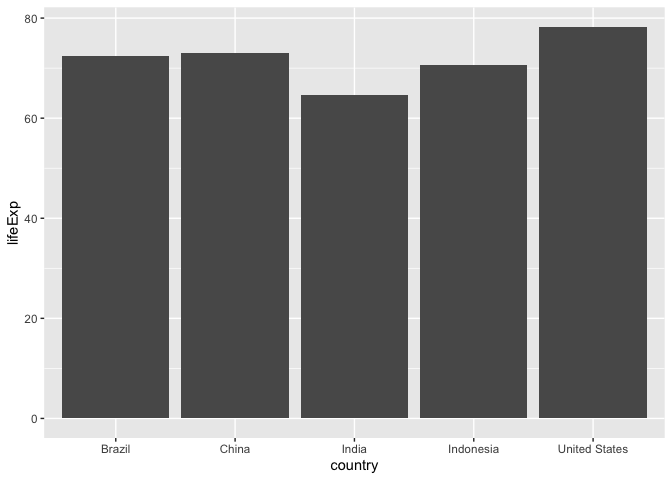

``` r
ggplot(gapminder_top5) + 
  geom_col(aes(x = country, y = pop, fill = continent))
```

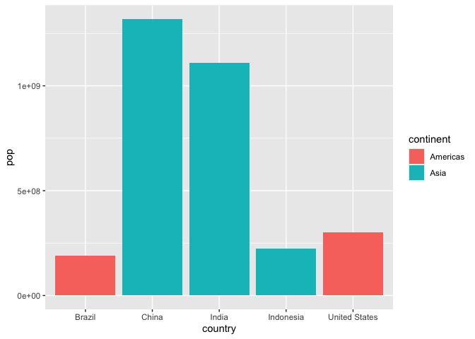

``` r
ggplot(gapminder_top5) + 
  geom_col(aes(x = country, y = pop, fill = lifeExp))
```

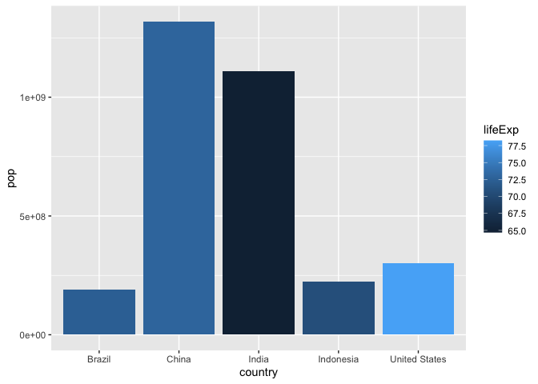

``` r
ggplot(gapminder_top5) +
  aes(x=country, y=pop, fill=gdpPercap) +
  geom_col()
```

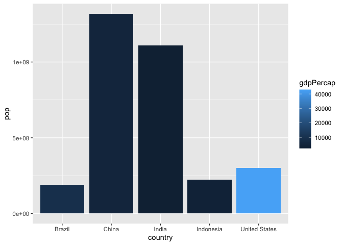

``` r
ggplot(gapminder_top5) +
  aes(x=reorder(country, -pop), y=pop, fill=gdpPercap) +
  geom_col()
```

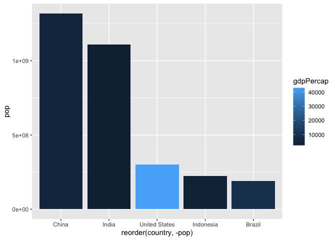

``` r
ggplot(gapminder_top5) +
  aes(x=reorder(country, -pop), y=pop, fill=country) +
  geom_col(col="gray30") +
  guides(fill="none")
```


``` r
head(USArrests)
```

               Murder Assault UrbanPop Rape
    Alabama      13.2     236       58 21.2
    Alaska       10.0     263       48 44.5
    Arizona       8.1     294       80 31.0
    Arkansas      8.8     190       50 19.5
    California    9.0     276       91 40.6
    Colorado      7.9     204       78 38.7

``` r
USArrests$State <- rownames(USArrests)
ggplot(USArrests) +
  aes(x=reorder(State,Murder), y=Murder) +
  geom_col() +
  coord_flip()
```


``` r
ggplot(USArrests) +
  aes(x=reorder(State,Murder), y=Murder) +
  geom_point() +
  geom_segment(aes(x=State, 
                   xend=State, 
                   y=0, 
                   yend=Murder), color="blue") +
  coord_flip()
```

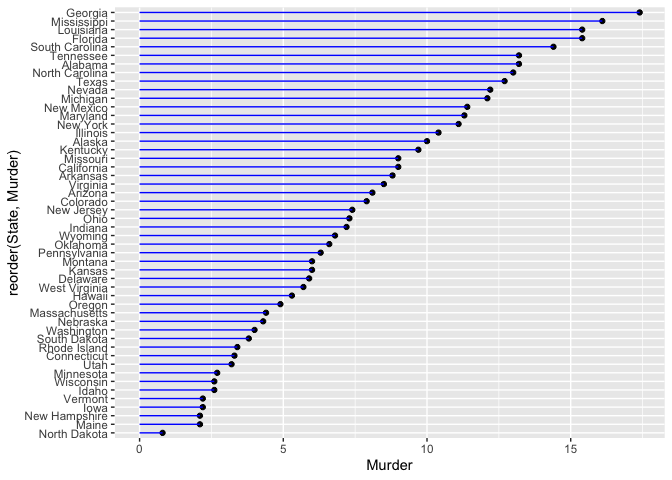

library(gapminder) library(gganimate)

# Setup nice regular ggplot of the gapminder data

ggplot(gapminder, aes(gdpPercap, lifeExp, size = pop, colour =
country)) + geom_point(alpha = 0.7, show.legend = FALSE) +
scale_colour_manual(values = country_colors) + scale_size(range = c(2,
12)) + scale_x_log10() + \# Facet by continent facet_wrap(~continent) +
\# Here comes the gganimate specific bits labs(title = ‘Year:
{frame_time}’, x = ‘GDP per capita’, y = ‘life expectancy’) +
transition_time(year) + shadow_wake(wake_length = 0.1, alpha = FALSE)
